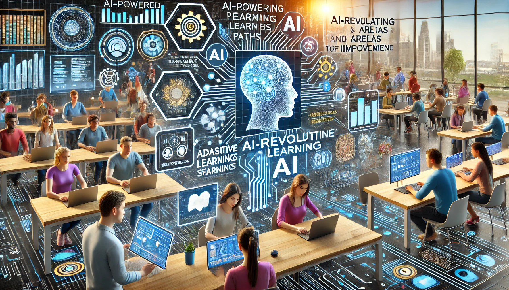

𝗟𝗲𝘃𝗲𝗿𝗮𝗴𝗶𝗻𝗴 𝗔𝗜 𝘁𝗼 𝗣𝗲𝗿𝘀𝗼𝗻𝗮𝗹𝗶𝘇𝗲 𝗟𝗲𝗮𝗿𝗻𝗶𝗻𝗴 𝗘𝘅𝗽𝗲𝗿𝗶𝗲𝗻𝗰𝗲𝘀 🎓

Tired of generic training programs that don’t quite hit the mark?

You’re not alone. One-size-fits-all training often fails to meet individual learning needs, leaving employees frustrated and skill gaps unaddressed. The cost of inaction? Employees may not fully benefit from training, leading to decreased productivity and potential turnover.

But there's a solution: AI-driven tools can revolutionize your training approach by creating personalized learning paths tailored to individual strengths and areas for improvement.

Here’s how to leverage AI for a truly personalized learning experience:

📌 Analyze Learning Data: AI can analyze vast amounts of data to understand each employee’s learning style, strengths, and weaknesses. This insight allows for the creation of tailored training modules that address specific needs.

📌 Adaptive Learning Paths: Implement AI tools that adjust learning paths in real-time based on individual progress and performance. This ensures that employees are always engaged and challenged, maximizing their learning potential.

📌 Personalized Content Recommendations: Use AI to recommend relevant courses, articles, and resources based on an employee’s role, interests, and learning history. This keeps training fresh and aligned with career goals.

📌 Real-Time Feedback and Support: AI-driven platforms can provide immediate feedback and support, helping learners understand mistakes and improve quickly. This real-time assistance enhances the overall learning experience and retention.

Ready to get started? Here’s your action plan:

📝 Assess Current Training Programs: Identify the gaps and limitations of your existing training programs. Understanding these shortcomings will help you effectively implement AI solutions.

📝 Choose the Right AI Tools: Look for AI platforms that specialize in personalized learning. Prioritize tools that offer data analysis, adaptive learning paths, and real-time feedback. Ensure they integrate smoothly with your Learning Management System (LMS).

📝 Train Your L&D Team: Make sure your Learning and Development team is well-versed in using AI tools. Provide training sessions to help them understand and maximize the benefits of these technologies.

📝 Monitor and Optimize: Continuously assess the effectiveness of your AI-driven learning programs. Gather feedback from employees and adjust the learning paths to improve the experience further.

Implementing AI in your training programs isn’t just about keeping up with trends; it’s about leading the way. Imagine a workforce where each employee is equipped with the skills they need, tailored to their unique learning style and career goals. That’s the future of learning, and it’s here now.

Got insights or experiences with AI in personalized learning? Share your thoughts below! ⬇️

#AI #PersonalizedLearning #LearningAndDevelopment #EmployeeEngagement #FutureOfWork #Innovation