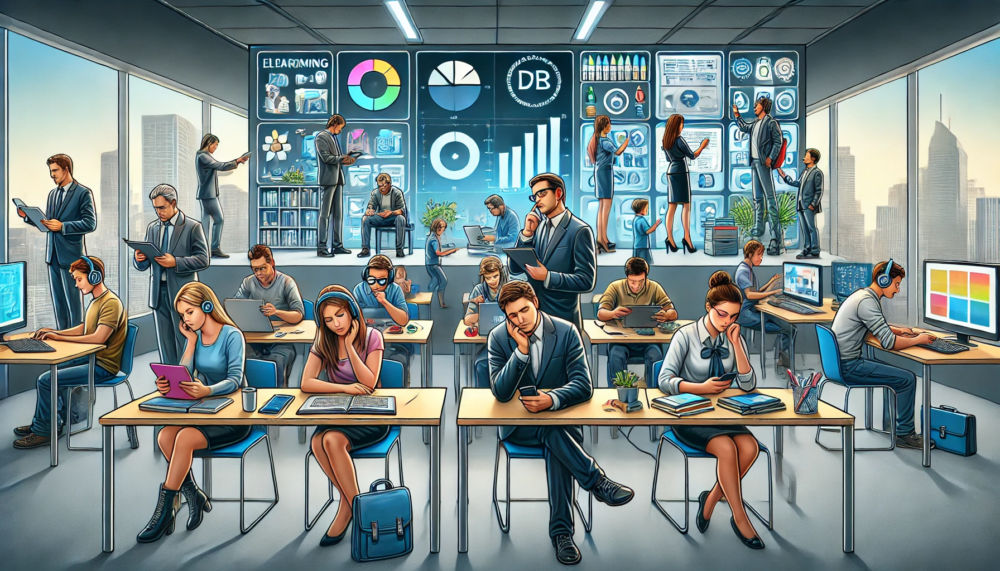

𝗛𝗼𝘄 𝘁𝗼 𝗗𝗲𝘀𝗶𝗴𝗻 𝗘𝗳𝗳𝗲𝗰𝘁𝗶𝘃𝗲 𝗟&𝗗 𝗣𝗿𝗼𝗴𝗿𝗮𝗺𝘀 𝗳𝗼𝗿 𝗠𝗶𝗹𝗹𝗲𝗻𝗻𝗶𝗮𝗹𝘀 𝗮𝗻𝗱 𝗚𝗲𝗻 𝗭 🚀

Struggling to engage your Millennial and Gen Z employees with your current L&D programs?

The truth is, younger generations have unique learning preferences and expectations. Ignoring these can lead to disengagement, stagnant skills development, and ultimately, a less competitive workforce.

Here's how to craft an L&D strategy that resonates with Millennials and Gen Z:

📌 Digital-First Approach: These generations are digital natives. Leverage e-learning platforms, mobile apps, and online courses to deliver training. This not only meets their tech-savvy expectations but also provides flexibility in learning.

📌 Interactive Content: Gone are the days of passive learning. Incorporate interactive elements like quizzes, simulations, and gamified modules. This keeps learners engaged and makes the training more effective.

📌 Social Learning: Millennials and Gen Z thrive on social interaction. Integrate social learning elements such as discussion forums, peer reviews, and collaborative projects. This fosters a sense of community and enhances knowledge sharing.

📌 Microlearning: Short, bite-sized lessons are far more appealing to these generations. Break down complex topics into manageable chunks that can be consumed quickly and easily.

📌 Personalized Learning Paths: Use AI and data analytics to tailor learning experiences to individual preferences and career goals. Personalized content increases relevance and motivation.

📌 Focus on Soft Skills: While technical skills are important, soft skills like communication, leadership, and emotional intelligence are highly valued by Millennials and Gen Z. Include training modules that enhance these competencies.

📌 Instant Feedback: These generations are used to immediate feedback from social media and other platforms. Incorporate real-time feedback mechanisms to keep them informed about their progress and areas for improvement.

📌 Accessibility and Inclusivity: Ensure that your L&D programs are accessible to all employees, including those with disabilities. Use subtitles, closed captions, and alternative text to make content inclusive.

Implementing these strategies will help you create an L&D program that not only meets the expectations of Millennials and Gen Z but also drives engagement and skill development. A well-designed program can transform your workforce into a dynamic, competitive asset.

What strategies have you found effective in engaging younger employees in L&D? Share your insights below!

#LearningAndDevelopment #Millennials #GenZ #TrainingInnovation #EdTech #EmployeeEngagement #HR

