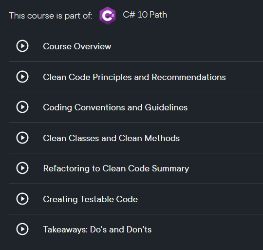

# Technical Debt and C# Best Practices

Do you spend more time coding from scratch or do you spend more time maintaining an existing code base? 

With very few exceptions, we typically spend a lot more time updating, improving, and fixing an existing application, which means that it is highly likely that we are going to run into some technical debt.

Do you know what technical debt is?

Technical debt is a concept in software development that refers to the cost of additional rework caused by choosing a quicker or easier solution when developing a product, rather than using a better approach that would take longer.

This “debt” is incurred because the quicker solution may be less efficient, more error-prone, or harder to maintain in the long run. The idea is that, like financial debt, technical debt can be manageable if it is recognized and addressed early on, but if it is allowed to accumulate, it can become a burden that slows down development and increases the risk of problems in the future.

Technical debt can arise for a variety of reasons. For example, a team may choose to cut corners to meet a tight deadline, or they may be working with limited resources and have to make do with what they have. In some cases, technical debt may be incurred intentionally, as a trade-off to get a product to market more quickly or to test a new feature. However, it is important to carefully consider the long-term costs and benefits of incurring technical debt, and to make a plan to pay it off as soon as possible. Otherwise, it can become a major impediment to the success of a product.

IMHO, it is called techical debt because the individual that wrote the original code OWES me a lot of time that I spent understanding the code to actually beging to works.

Sometimes it even takes me a lot of time to understand the original code that was written by none other than myself!

However, as I became a more experienced developer, I learned how following coding best practices can greatly improve the process of maintaining an application.

Just so that we are on the same page, a best practice is a method or technique that has been proven to be effective in achieving a specific goal or objective. It is a standard or benchmark that is widely accepted and recommended within a particular industry or field as the most effective way to approach a particular task or problem. Best practices are based on the accumulated knowledge and experience of experts and professionals in a given field, and are typically designed to maximize efficiency, effectiveness, and overall quality of outcomes.

For C#, there is a set of best practices that you can find in the C# Coding Conventions page, which in turn were adopted from the .NET Runtime, C# Coding Style.

There are many best practices that developers should follow to ensure that their code is efficient, well-structured, and easy to maintain. 

Here are some of the top C# best practices that every developer should keep in mind:

– Use meaningful names for variables, methods, and classes. Naming conventions are important because they help other developers understand what your code does and how it works. Avoid using abbreviations or single-letter names, and use camelCase for variables and PascalCase for methods and classes.

– Use proper indentation and whitespace to make your code more readable. Proper indentation helps to visually group related code together, making it easier for other developers to follow your logic. Use blank lines to separate blocks of code and add comments to explain what each section of code does.

– Use constants instead of hardcoded values. Constants are values that are defined once and cannot be changed. Using constants helps to make your code more maintainable, as you can easily update the value of a constant in one place instead of having to search through your code for hardcoded values.

– Avoid using null values if possible. Null values can cause NullReferenceExceptions, which can be difficult to debug. Instead, use default values or create your own null object class to handle null values.

– Use exception handling to handle errors in your code. Exceptions allow you to gracefully handle errors and prevent your application from crashing. However, be sure to use exception handling sparingly and only for situations where it is truly necessary.

– Follow the SOLID principles of object-oriented design. The SOLID principles – Single Responsibility, Open-Closed, Liskov Substitution, Interface Segregation, and Dependency Inversion – help to create maintainable and scalable code.

I have summarized these best practices in my course, C# 10 Best Practices, click on this link to learn more:

By following these best practices, you can ensure that your C# code is of high quality and easy to maintain. Remember to always think about the long-term maintainability of your code, as it will save you time and headaches in the future.

Feel free to drop me a note if you have questions or comments! You can find me on https://twitter.com/xmorera or through my contact form!

This post is part of the C# Advent Calendar 2022 which you can find at https://csadvent.christmas/, courtesy of Matthew D. Groves! Please check the advent calendar for more great blog posts!

Dec 23, 2022