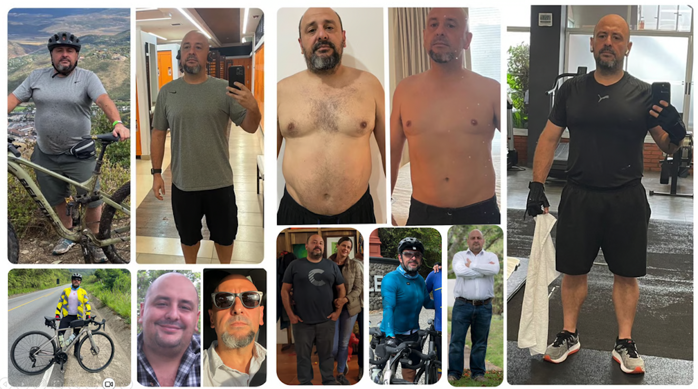

# Let's Get Healthy Together: Fit Fat Fit

Hello, I am Xavier Morera and I have ADHD... which can be an obstacle but it can also be a superpower. More on this later...

If you don't know me, I am a software developer who is very passionate about teaching, mainly through video training at Pluralsight and Lupo.ai.

Also, this year I went through a big mind and body transformation. I was a sedentary and obese knowledge worker with very bad habits. 

I was able to make a complete change and take control of my life by learning a few things, which I am now starting to share with the world with my book: "Unfatting Myself: Getting Fit in Your Middle Age".

Why am I doing it? Because having experienced such a change, I can tell you that it is totally worth it to be healthy and fit. Most of us also think it is not possible to make such a change, yet I did it without fad diets, surgery, pills, injections or anything.

It just took knowledge, raw discipline, and consistency. 

I started a newsletter and I am launching a kickstarter campaign the second week of January 2025 to help pay for the editing and revision costs. I invite you to join me on this journey which can help you or someone you know change their life: 

https://xaviermorera.com/fitfatfit/

I am not a nutritionist nor a sports coach. I am an average guy, which means that if I can do it, so can you.

Sign up and let's get healthy together!
