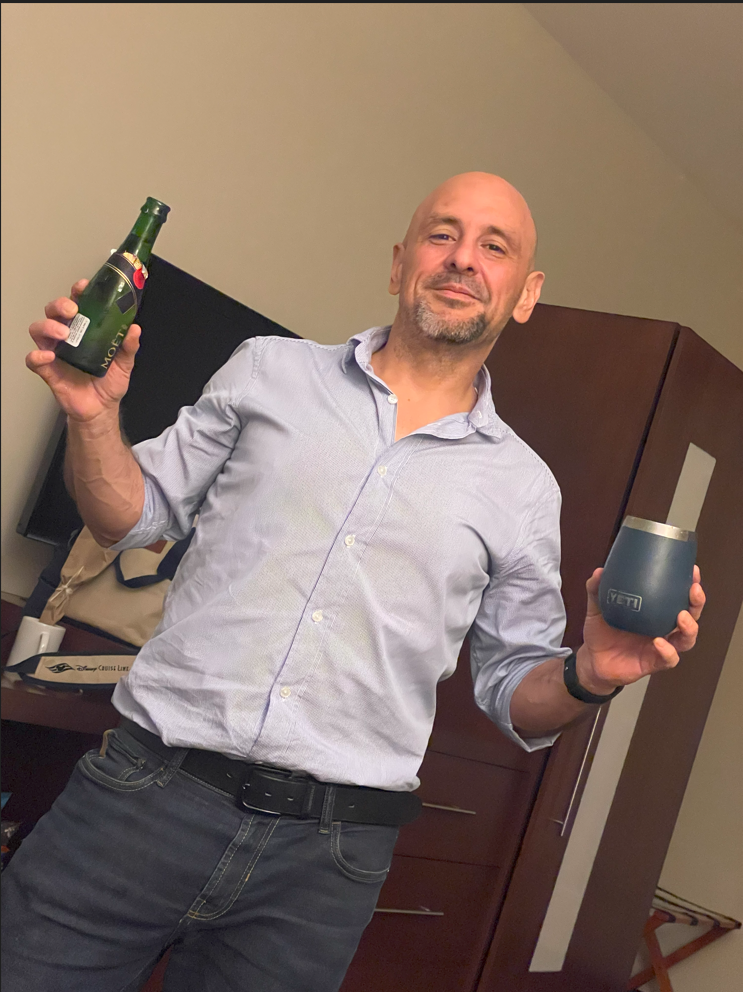

# Wishing You a 2025 Without Resolutions... Say What?

Every year, around this time of the year we all make a huge list of new year resolutions that we intend to keep... goals we would like to achieve... things that this year we really-really-I-promise-I-will-do-this-time-around.

But if there is one thing that 2024 taught me is that we do not achieve what we wish to do. We don't achieve our goals because motivation wears off... life gets in the way... you bought a cake... accidentally... you are too tired... pick your excuse.

The way to achieve our goals is to change our habits and those little actions compounded over time are the ones that decide what we achieve

If I can sum it up in one sentence, this would be it: "You do not rise to the level of your expectations. You fall to the level of your systems".

So here I am wishing you a 2025 without any resolutions. 

Instead, I wish you that you change your habits and achieve that thing that you have dreamt of for years but haven't been able to.

Here are a few tips with the most common resolutions (I asked AI to give me this list of resolutions, but the advice is mine):

1. Exercise More: Stop relying on motivation to go to the gym or workout. Put the workout time in your calendar and don't ask yourself "should I go to the gym". Instead, it should be "today is Tuesday and I HAVE to be at the gym at 6:30 am".

2. Lose Weight: Don't get me started, but it is easy. You are what you eat. I literally was what I ate. Get a nutritional plan and follow the F-ing plan. Don't THINK about what you want to eat. Plan your meals according to what you can eat and donate all those chocolates and sodas... maybe do it to someone you secretly hate and laugh all the way to Instagram. (If you receive a box full of chocolates, be suspicious...)

3. Eat Healthier: Read the previous one.

4. Save Money/Spend: Less Do a freaking budget and stop buying things you do not need to impress people you don't really care about with money you don't have. Period. Bar none.

5. Quit Smoking or Reduce Alcohol Consumption: Easy peasy. Been here, done that. Just stop smoking and set a reasonable limit on alcohol. Or get a sport. Biking is a really good motivator for both. Yes, it is hard. You can do it.

6. Get Organized: If you did the list for the family and travel ones, just keep the momentum.

At a high level, that's how "easy" it is. If you want to make changes in your life, you simply need to focus on the mechanics... on your habits... the little things that you do each day which will compound, add up, and at the end they will change your life.

I know because my habits changed my life in 2024.

Here's for a wonderful 2025!