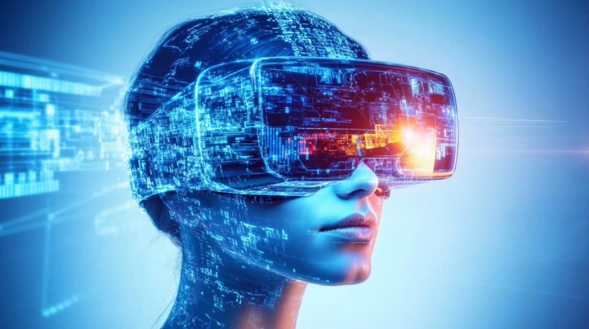

𝗟𝗲𝘃𝗲𝗿𝗮𝗴𝗶𝗻𝗴 𝗩𝗶𝗿𝘁𝘂𝗮𝗹 𝗥𝗲𝗮𝗹𝗶𝘁𝘆 (𝗩𝗥) 𝗳𝗼𝗿 𝗜𝗺𝗺𝗲𝗿𝘀𝗶𝘃𝗲 𝗟𝗲𝗮𝗿𝗻𝗶𝗻𝗴 𝗘𝘅𝗽𝗲𝗿𝗶𝗲𝗻𝗰𝗲𝘀 🎓

Feeling like your traditional e-learning modules are falling flat?

We’ve all been there—staring at static slides or reading endless text that fails to capture our attention. This lack of engagement can seriously undermine the effectiveness of your training programs, leaving employees underprepared and your organization lagging behind.

Here’s a game-changing solution: Integrate Virtual Reality (VR) into your Learning and Development (L&D) programs. Trust me, it’s not just about high-tech gimmicks—it’s about creating immersive, hands-on learning environments that make skills and knowledge stick.

Here’s how you can transform your training with VR:

🎓 Create Realistic Scenarios: Use VR to simulate real-world situations that employees may face in their roles. This hands-on practice is invaluable for deep learning and skill retention. Imagine training a pilot or a surgeon—VR provides a risk-free environment to hone critical skills.

🎓 Boost Engagement and Retention: VR’s immersive nature captures learners’ attention like nothing else. Studies show that immersive learning significantly enhances information retention, ensuring that employees are not just learning but mastering the content.

🎓 Personalized Learning Paths: VR can adapt to individual learning styles and paces, offering a customized experience for each employee. This tailored approach helps address specific weaknesses and reinforces strengths, maximizing the impact of your training programs.

🎓 Safe and Controlled Environment: VR offers a safe space for employees to make mistakes and learn from them without real-world consequences. This is particularly beneficial for high-stakes industries like healthcare, aviation, and manufacturing.

🎓 Cost-Effective in the Long Run: While initial setup costs for VR may be high, the long-term benefits far outweigh the investment. With VR, you can provide consistent training experiences across different locations, reducing travel and operational costs.

🎓 Gamification Elements: Integrate gamified elements like points, badges, and leaderboards to make learning fun and competitive. This not only boosts engagement but also fosters a culture of continuous learning and improvement.

By leveraging VR in your L&D programs, you can ensure that your employees are not only engaged but truly absorbing and retaining critical skills and knowledge. This investment in immersive learning will pay off in a more competent, confident, and competitive workforce.

Got any innovative ideas for integrating VR into training? Share your thoughts below! ⬇️

#VirtualReality #ImmersiveLearning #TrainingInnovation #L&D #EdTech #FutureOfWork #SkillDevelopment #EmployeeEngagement