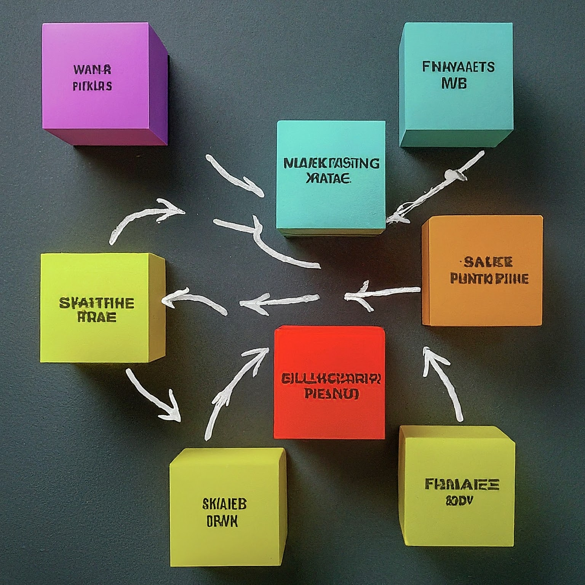

𝗧𝗵𝗲 𝗜𝗺𝗽𝗼𝗿𝘁𝗮𝗻𝗰𝗲 𝗼𝗳 𝗖𝗿𝗼𝘀𝘀-𝗙𝘂𝗻𝗰𝘁𝗶𝗼𝗻𝗮𝗹 𝗧𝗿𝗮𝗶𝗻𝗶𝗻𝗴 🌐

Feeling like your team is stuck in their silos with a narrow focus on their specific roles?

You’re not alone. When employees are confined to their functional areas, it limits their understanding of the broader business landscape. This can lead to poor collaboration, missed opportunities for innovation, and an overall lack of strategic alignment within the organization.

Here’s a roadmap to implement effective cross-functional training and break down those barriers:

📌 Develop a Comprehensive Training Plan: Start by identifying key areas where cross-functional knowledge is essential. Create a structured plan that includes job rotations, shadowing, and inter-departmental projects. This helps employees gain firsthand experience in different roles and understand how various functions contribute to the organization's goals.

📌 Foster a Culture of Learning: Encourage a mindset where continuous learning and curiosity are valued. Promote the benefits of cross-functional training through internal communications, success stories, and by recognizing employees who embrace these opportunities. This builds an environment where learning from other departments is seen as a career development opportunity.

📌 Utilize Collaborative Tools: Implement project management and collaboration tools that facilitate cross-functional communication. Platforms like Microsoft Teams, Asana, or Trello can help teams from different departments work together seamlessly on shared projects, promoting a culture of cooperation and teamwork.

📌 Schedule Regular Inter-Departmental Meetings: Organize regular meetings where different departments can present their work, challenges, and achievements. This fosters transparency and provides a platform for employees to learn about other areas of the business, ask questions, and share insights.

📌 Launch Cross-Functional Workshops and Training Sessions: Host workshops and training sessions that focus on cross-functional skills and knowledge. Topics can range from understanding financial metrics to learning about marketing strategies or supply chain management. This broadens employees’ skill sets and enhances their ability to contribute to diverse areas of the business.

📌 Encourage Mentorship and Coaching: Pair employees with mentors or coaches from different departments. This not only facilitates knowledge transfer but also helps build relationships across the organization, enhancing collaboration and breaking down silos.

📌 Measure and Adjust: Continuously assess the impact of cross-functional training through feedback, performance metrics, and employee surveys. Use this data to refine your training programs and ensure they meet the evolving needs of your organization.

Implementing cross-functional training can significantly enhance collaboration and innovation, giving employees a broader perspective of the business. This leads to a more agile and cohesive organization, ready to tackle challenges and seize opportunities.

Got other strategies for effective cross-functional training? Share your experiences below! ⬇️

#CrossFunctionalTraining #Collaboration #Innovation #LearningAndDevelopment #BusinessGrowth #Teamwork