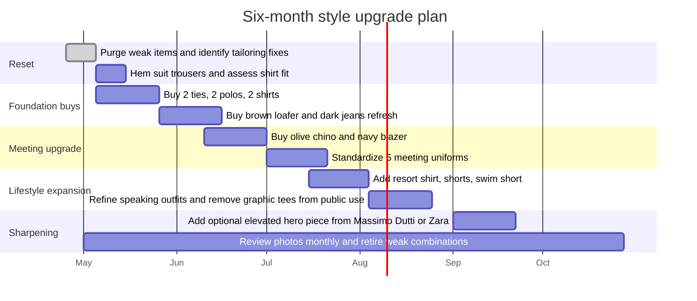

# Dress-for-Success System for Xavier Morera

## Executive summary

Your style target is not “executive in a suit.” It is **sporty authority**: a founder-operator who looks fit, competent, mature, approachable, and clearly in motion. That direction fits your public profile unusually well. Your visible work spans technical education and AI/software entrepreneurship: your Pluralsight author page positions you around AI, machine learning, generative AI, search, and big data, and Lupo presents itself as a knowledge-to-execution platform used for training, onboarding, and AI-guided execution. That means your clothes need to work across developers, founders, operators, and business owners, not just one tribe. Costa Rica’s warm climate and wet/dry seasonal rhythm also make breathable, low-bulk clothes a hard requirement, not a preference. citeturn32search8turn33search1turn17search6

The photos point to a clear answer. Your strongest current looks are the ones that combine **light blue or cool blue-gray near the face, dark denim below, open collars, and clean lines without over-formality**. The weakest looks are not because you “dress badly”; they fail because they go in the wrong direction: either too generic tech-casual, too graphic, too stiff, or too severe. The winning system for you is: **blue-led tops, dark jeans, soft-structured layers, matte textures, and one notch-more-polished footwear than you currently default to**.

Your most efficient wardrobe build is this: buy **two ties, three shirts, two polos, one better meeting shoe, one blazer, one olive chino, and one charcoal/gray layering piece first**. Use Uniqlo, Zara, Banana Republic Factory, Gap Factory, Nordstrom Rack, Macy’s, and On as your U.S.-first core stack. Use Massimo Dutti sparingly for a few elevated pieces, and use Arturo Calle/PatPrimo mainly when purchasing in Colombia or through forwarding, because the official shipping language currently points primarily to Colombia, and in PatPrimo’s case Colombia/Ecuador. citeturn18search1turn18search2turn18search5turn40search0turn40search1

If you follow one principle from this report, make it this: **stop trying to choose between sporty and polished**. Your best image is the overlap. Not running gear. Not banker costume. **Athletic founder polish.**

## Public context and visual diagnosis

Publicly, your positioning is already high-trust and high-competence. Pluralsight describes you as an author focused on complex technical topics and currently lists you as a co-founder of Lupo.ai, with work spanning enterprise software, training, AI, and startups to major tech companies. Lupo itself markets to organizations that need structured knowledge, training, and AI agents to improve execution. That means your wardrobe should project two things at once: **technical credibility** and **operational leadership**. Too casual makes you look like “just another dev.” Too formal makes you look like you borrowed someone else’s identity. citeturn32search8turn33search1

Based on the supplied photos, your coloring reads **neutral-warm leaning olive/peach**, not icy-cool and not heavily golden. Your contrast level is **medium**: the bald head lowers top-of-head contrast, but the brows, eyes, and salt-and-pepper beard restore definition. That makes you look best in **deep, softened colors** rather than washed-out beige or loud neon saturation. The face shape reads **oval to slightly oblong**, which is why open collars, spread collars, and lightly structured shoulders help. Small collars or weak necklines undercut presence.

Your body currently reads **compact-athletic and active**, not lanky and not bulky. The weight loss matters because it changes how clothes lie: old-style roomy clothing will make you look like you are still hiding, while ultra-slim Euro fits will make you look like you are trying too hard. You need **taper and structure, not tightness**. In practice that means: shoulders should fit first, chest should skim rather than cling, waist should suppress slightly without pulling, and trousers should cleanly taper below the knee without going skinny.

Posture-wise, you generally photograph as open and upright, but a few images suggest the mild forward-head / rounded-shoulder pattern common in desk-heavy technical work. That is not a body issue; it is a styling issue too. It means you benefit from **firmer collars, cleaner shoulder seams, open necklines, and jacket structure**. Those things visually square you up.

The best current evidence from your photos is blunt:
- **Best business-casual template:** light blue shirt + dark jeans.
- **Best formal template:** dark suit + burgundy tie.
- **Best evening authority template:** dark shirt, tonal dark trousers.
- **Weakest public template:** graphic tee under a vest while speaking.
- **Weakest structural choice:** very black/stiff lower halves in daytime settings.

That is enough to build the whole system.

## Color system

Your palette should be built around **cool blues, softened dark neutrals, and controlled accents**. That aligns with your photos, your stated preferences, and the fact that light blue shirts and dark neutrals are among the easiest, most versatile menswear anchors. Macy’s own styling guide notes that a light blue shirt works especially well with navy, purple, and pale orange ties, and that white/navy and black/gray sit in the safe neutral zone. For you, that translates into **navy, burgundy, and forest** as the only tie colors you actually need. citeturn35search0turn34search5

**Core neutrals**

-  **Deep Navy** `#1F355E` — primary blazer, polo, tie, and chino neutral.
-  **Charcoal** `#343A40` — tees, vest, denim alternative, evening shirt.
-  **Dark Indigo** `#2F4A6D` — your default jean color.
-  **Soft White** `#F4F1E8` — better than optic white in casualwear.
-  **Steel Gray** `#6B6F75` — useful in tees, sneakers, and light layering.

**Signature blues**

-  **Air Blue** `#AFC5E6` — your highest-ROI shirt color.
-  **Dusty Blue** `#7B95B8` — polos and striped shirts.
-  **Petrol Blue** `#3B6B8A` — gives maturity without looking corporate.
-  **Chambray Blue** `#5E7694` — ideal for shirts with jeans.

**Controlled accents**

-  **Burgundy** `#6F2333` — your best formal accent; proven by your suit photos and supported by tie guidance around light blue shirts. citeturn35search0turn21search4turn21search6
-  **Olive** `#55624A` — excellent for chinos, overshirts, and resort pieces.
-  **Forest** `#2E5347` — strong alternative accent for polos or ties.
-  **Muted Taupe** `#A58C6B` — only below the waist or in small doses.

**Tie system for the Kenneth Cole suit**

Buy exactly these first:
- **Textured burgundy tie** — the strongest option with white or light blue shirt. Macy’s has multiple current burgundy textured or solid-texture tie options in the roughly $30–$70 range. citeturn21search4turn21search6turn34search6
- **Textured navy tie** — safest, smartest second choice. citeturn35search5turn21search9
- **Navy/burgundy striped tie** — optional third tie, ideal when you want more character without loudness. citeturn21search0turn21search8turn21search9

**Colors to avoid near your face**

Avoid these unless they are athletic gear or tiny accents:
- Neon orange
- Acid lime
- Mustard yellow
- Muddy camel
- Dusty mauve
- Warm beige that is too close to your skin
- Shiny jet black in broad daylight

Those colors either flatten your face, compete with your skin, or push you into “trying too hard” territory.

## Fit and silhouette rules

Costa Rica’s climate makes fabric and cut non-negotiable. Official tourism guidance emphasizes warm conditions with distinct dry and green seasons, while brands like Uniqlo, Zara, Banana Republic Factory, and Massimo Dutti explicitly position linen, cotton-linen, and performance polos as breathable, warm-weather staples. For you, that means **linen, cotton-linen, piqué, AIRism-style performance knits, tropical wool, and matte technical fabrics** should dominate. Heavy sweaters, lined jackets, and thick dress pants are mostly wasted wardrobe space. citeturn17search6turn37search0turn38search1turn19search2turn29search5turn15search5

**Shirts**  
Go with spread, semi-spread, or button-down collars. The collar should hold shape when open. Shoulder seams should sit on the shoulder bone. You want enough room to move, but no fabric pooling over the waist. Linen and oxford are right; glossy sateen or shiny formal cotton is wrong. Macy’s dress-shirt guide emphasizes fit and fabric quality, and Uniqlo/Zara both currently offer strong long-sleeve linen options around the $49.90–$69.90 range. citeturn34search0turn34search5turn37search0turn29search2turn29search8

**Polos**  
This is one of your highest-ROI categories. Use piqué, AIRism, or knit polos with a firm collar and a body that skims. Uniqlo’s AIRism Cotton Pique Polo is explicitly built to keep the look of cotton while adding stay-fresh comfort, and H&M, Banana Republic Factory, and J.Crew Factory all have classic-fit or regular-fit polo options in the entry-to-midrange. Your best colors are navy, charcoal, dusty blue, forest, and soft burgundy. Skip contrast piping, giant logos, and golf-bro patterns. citeturn38search0turn38search1turn38search8turn30search2turn27search1turn28search11

**Tees**  
Use solid tees only for public life unless the setting is fully private. Crew neck is fine, but keep the neck opening clean and not overly high. Best weights are midweight cotton or smooth technical cotton-blend. Charcoal, navy, soft white, and black are your only real tee colors. Stop using large front graphics for work-adjacent settings.

**Jeans**  
You look best in **dark rinse, medium-dark indigo, and charcoal**. Straight or athletic-taper is correct. Gap Factory and Zara both currently describe straight-fit jeans as the versatile middle ground: clean, easy to dress up, and good for movement. That maps directly to your needs as a walker, cyclist, and founder who still wears jeans most of the time. Avoid distressing, excessive whiskering, super-light wash, and extra-skinny calves. citeturn19search6turn19search3turn29search0turn29search3

**Chinos**  
You say you dislike formal pants. Fine. Do not buy formal pants as daily wear. Buy **athletic chinos** instead. Banana Republic Factory’s athletic chino is one of the clearest pattern matches for you because it is cut with extra room through the seat and thighs, then tapers through the leg with a slim opening. Buy olive, stone, and possibly navy. These are your meeting trousers when jeans are not enough. citeturn27search0turn27search3turn27search7

**Blazers**  
You need **one unstructured blazer** in navy. That is it to start. Prefer linen, cotton-linen, or a matte knit/cotton blend, half-lined or lightly lined. Massimo Dutti, Zara, Banana Republic Factory, and Nordstrom Rack all show current options in this lane, with Zara and Nordstrom Rack especially useful for value and Massimo Dutti useful for a more elevated Mediterranean profile. Avoid shiny worsted wool, shiny black, and heavily padded shoulders. citeturn15search5turn15search9turn27search4turn22search0turn22search5

**Jackets and overshirts**  
These should feel sporty, not tactical. Best versions: matte vest, clean overshirt, light technical shell, light chambray shirt-jacket. Uniqlo’s Ultra Light Down Vest remains a useful travel or cool-room layer, but not something to wear daily in Costa Rica heat. Zara and Massimo Dutti overshirts are good when they stay matte and clean. citeturn39search0turn39search2turn15search7

**Shorts and swimwear**  
Go tailored, not adolescent. H&M’s linen shorts and swimwear pages are a decent value baseline: simple, warm-weather, easy colors. Use 7"–8.5" inseams for shorts, flat fronts, and colors like navy, olive, sand, or charcoal. Swim shorts should be solid or lightly textured, mid-thigh, never loud tropical print unless you are intentionally joking. citeturn20search0turn20search3turn30search5

**Suits**  
Your existing Kenneth Cole suit is usable. The photo says the suit is fine; the styling needs sharpening. Keep the jacket if it still fits the shoulders. Hem the trouser to a slight break or near-no-break. Use a white or light blue shirt and one of the tie colors above. Do not buy more formalwear until the core casual/business system is fixed.

**Shoes**  
Your On shoe preference is valid. On’s current lineup explicitly positions the Cloud 6 as an all-day staple and the Cloudnova 2 as a street-ready all-day sneaker. Keep On for daily wear, walking, travel, and developer-casual meetings. But you also need **one brown loafer** and **one black dress shoe**. Macy’s and Nordstrom Rack are currently strong for accessible Cole Haan-style loafers and derbies in the roughly $80–$140 and $50–$100 lanes respectively. citeturn16search1turn16search4turn16search2turn23search0turn23search4turn22search7

## Occasion wardrobe and repeatable uniforms

What follows is the actual operating system. Use these formulas instead of re-deciding your identity every morning.

**Daily**  
Formula: dark jeans + solid polo or oxford + On shoes + optional overshirt/vest.  
Best colors: air blue, dusty blue, navy, charcoal, olive.  
Best fabrics: piqué, AIRism, oxford, linen-cotton.  
Why it works: authority without stiffness; aligns with your strongest photo evidence and your actual movement-heavy life.  
What to avoid: big graphics, washed-out jeans, hoodie-first outfits.

**Business casual for EO**  
Formula: open-collar light blue or white oxford/linen shirt + dark denim or olive chino + loafer or clean darker sneaker + optional navy blazer.  
Why it works: mature, not boardroom; polished without costume.  
Avoid: black dress pants with zero texture, shiny shirts, over-accessorizing.

**Prospective-customer meetings with developers**  
Formula: charcoal or navy polo + dark indigo jeans + black or charcoal On shoes.  
Why it works: keeps credibility with technical people while looking intentional.  
Avoid: suit jacket over sneakers with a graphic tee. That combination reads confused.

**Prospective-customer meetings with founders**  
Formula: air blue shirt or knit polo + dark jeans or olive chino + brown loafer + navy blazer if needed.  
Why it works: founder-to-founder, not salesman-to-founder.  
Avoid: trying to out-dress them with banker formality.

**Prospective-customer meetings with traditional owners**  
Formula: white or light blue shirt + olive/stone/navy chinos + brown loafer + navy blazer.  
Why it works: trust, maturity, and seriousness without tropical funeral attire.  
Avoid: full black in daytime, visible tech vest, athletic sneakers.

**EO-level dinners or sharper business settings**  
Formula: textured white or light blue shirt + navy blazer + dark jeans or charcoal trouser + loafer.  
Why it works: this is your “I have taste but I’m not performing wealth” lane.  
Avoid: loud pockets squares, flashy watches, brand signaling.

**Speaking and teaching**  
Formula: solid dark knit polo or solid crew tee + dark jeans or chino + matte vest or soft blazer.  
Why it works: your face and message stay centered.  
Avoid: graphic tees, novelty prints, anything that competes with a slide deck.

**Going out in Santa Ana, Escazú, or Curridabat**  
Formula: black or charcoal knit polo / unbuttoned linen shirt over a fitted tee + dark jeans + brown loafer or sharp sneaker.  
Why it works: relaxed, masculine, mature.  
Avoid: loud fashion pieces, clunky dress shoes, nightlife peacocking.

**Beach and resort**  
Formula: solid swim short + open linen shirt + simple sandal/clean slip-on + sunglasses.  
Why it works: Costa Rica, not Miami cosplay.  
Avoid: tropical chaos prints, cargo shorts, oversized board shorts.

**Cycling-adjacent and post-ride**  
Formula: performance polo or fitted tee + tailored shorts or dark easy pants + On shoes.  
Why it works: acknowledges the athlete without staying in costume.  
Avoid: wearing cycling jerseys long after the ride unless you are literally riding.

**Formal but not stiff**  
Formula: Kenneth Cole suit + white shirt + burgundy textured tie + black shoe.  
Second version: same suit + light blue shirt + navy tie.  
Why it works: proven good colors, minimal risk, mature.  
Avoid: satin ties, huge knots, loud shirt patterns.

**Blue + jeans system**  
This is your native zone, so stop fighting it and refine it.
- Light blue shirt + dark rinse jeans + brown loafer.
- Dusty blue polo + charcoal jeans + black On.
- Petrol linen shirt + dark indigo jeans + brown loafer.
- Navy knit polo + medium-dark indigo + gray On.
- Chambray shirt + olive chino when you want a jeans-adjacent alternative.

Upgrade ladder:
- Tee to polo
- Polo to oxford
- Oxford to oxford + blazer
- On shoes to loafers
- Washed denim to dark denim
- Graphics to solids
- Random layer to matte structured layer

**Repeatable outfit formulas**

1. Air blue oxford + dark rinse jeans + brown loafer.  
2. White oxford + dark rinse jeans + brown loafer.  
3. Navy AIRism polo + dark rinse jeans + black On.  
4. Charcoal knit polo + dark indigo jeans + gray On.  
5. Petrol linen shirt + charcoal jeans + brown loafer.  
6. Pale blue stripe shirt + dark jeans + brown loafer.  
7. Olive overshirt + white tee + dark jeans + black On.  
8. Charcoal tee + dark indigo jeans + gray On.  
9. Navy polo + olive chino + brown loafer.  
10. Air blue shirt + olive chino + brown loafer.  
11. White shirt + stone chino + brown loafer.  
12. Dusty blue polo + stone chino + black On.  
13. Charcoal polo + navy chino + black On.  
14. Light blue shirt + navy blazer + dark jeans + loafer.  
15. White shirt + navy blazer + olive chino + loafer.  
16. Knit polo + blazer + dark indigo jeans + loafer.  
17. Solid black tee + matte charcoal vest + dark jeans + black On.  
18. Solid charcoal tee + matte vest + olive chino + black On.  
19. Soft white tee + muted blue overshirt + dark jeans + sneaker.  
20. Petrol polo + charcoal jeans + brown loafer.  
21. Black shirt + charcoal trouser + black dress shoe.  
22. Black shirt + dark jeans + brown loafer for evening.  
23. Open linen shirt + white tee + tailored sand shorts + slip-on.  
24. Open blue linen shirt + navy swim short + sandal.  
25. Black performance polo + dark tailored shorts + On shoes.  
26. Post-ride fitted tee + navy easy pant + On shoes.  
27. White dress shirt + burgundy tie + black suit.  
28. Light blue dress shirt + navy tie + black suit.  
29. White dress shirt + navy/burgundy stripe tie + black suit.  
30. Dusty blue polo + dark jeans + charcoal vest + black On.  
31. White oxford untucked + dark jeans + gray On for dev meetings.  
32. Air blue shirt untucked + dark indigo jeans + loafer for founder coffee.  
33. Navy knit polo + stone chino + loafer for EO lunch.  
34. Charcoal knit polo + olive chino + blazer for traditional-owner meeting.  

## Shopping strategy and capsule wardrobe

The stores below are ranked for **you**, not for the average man.

**Uniqlo**  
Best for foundations. Its current U.S. assortment is unusually aligned to your climate and lifestyle: Premium Linen Shirts are about $49.90, AIRism Cotton Pique Polos about $29.90, and the Ultra Light Down Vest works as an airport/cool-room layer rather than daily Costa Rica outerwear. Buy shirts, polos, and travel layers here. Skip heavy winter pieces. citeturn37search0turn38search0turn38search8turn39search0

**Zara**  
Best for current, clean smart-casual with edge. Current U.S. men’s linen shirts sit around $59.90–$69.90, linen items and polos cluster in the warm-weather range, and straight jeans run roughly $59.90–$79.90. Buy linen shirts, clean overshirts, and sharper jeans here. Skip trend-chasing wide pants, loud prints, and anything that feels fashion-content-creator coded. citeturn29search5turn29search2turn29search0turn29search3

**Banana Republic Factory**  
Best for value business-casual. Its current athletic chinos explicitly allow extra room in the seat and thigh with a tapered leg, and its polos and linen-blend shirts are squarely in your lane. Buy chinos, polos, and work-capable shirts here. Skip obvious monograms if visible and skip overly slim fits. Typical list prices sit around $50 for polos, $65–$70 for chinos, and $75–$80 for shirts before frequent markdowns. citeturn27search0turn27search1turn27search3turn19search2

**J.Crew Factory**  
Best for classic American polish without stiffness. Its untucked-fit flex piqué polo is designed to wear slightly shorter, and its flex piqué line fits true to size in a classic cut. Linen-blend shirts are a good secondary option too. Buy polos and, if the colors are right, a couple of easy weekend shirts. Skip very preppy color stories and anything too loud. citeturn28search11turn28search8turn14search7turn14search9

**Gap Factory**  
Best for jeans and untucked casual shirts. Current pages still push straight-fit jeans as the versatile middle ground and untucked oxford shirts as a relaxed-but-polished option. Buy dark denim and a couple of untucked oxfords here. Skip baggy fits and big-logo graphics. citeturn19search6turn19search3turn31search0turn31search1

**Massimo Dutti**  
Best for selectively upgrading the image. Current U.S. pricing shows jeans around $100–$130 and blazers around $320–$420, with linen tailoring and overshirts aimed squarely at the refined casual market. Buy one hero shirt or one blazer here, not your whole wardrobe. Skip anything suede-heavy or too winter-oriented for Costa Rica. citeturn15search4turn15search5turn15search8turn15search9turn15search7

**Nordstrom Rack**  
Best for deal-hunting jackets and shoes. Current men’s sport coats include linen and cotton-blend options around $100–$140, while dress shoes and derbies from brands like Cole Haan and Florsheim regularly land around $50–$100. Buy loafers, derbies, and possibly a lightweight blazer here. Skip shiny plaid sport coats and novelty fabric blends. citeturn22search0turn22search5turn22search7

**Macy’s**  
Best for ties, loafers, and occasional dress replacements. Current tie pricing is broadly around $30–$80; Cole Haan loafers regularly land around $80–$140. Buy your ties for the Kenneth Cole suit and one brown loafer here. Skip designer impulse buys that do not move the system forward. citeturn34search6turn21search4turn21search6turn23search0turn23search4

**On**  
Best for your active-core shoe system. The Cloud 6 is explicitly positioned as a staple all-day shoe at about $160; the Cloudnova 2 is the more street-ready option around $170; the waterproof version sits around $180. Keep black/gray for daily wear. Do not try to force these into formal situations. citeturn16search1turn16search4turn16search2

**H&M**  
Best for inexpensive summer and beach backups. Current men’s regular jeans run roughly $34.99–$49.99, polos from roughly $19.99 to $49.99, linen shorts around $29.99–$39.99, and swimwear around $24.99–$29.99. Buy cheap seasonal resort stuff here. Skip flimsy tailoring and logo-heavy trend pieces. citeturn20search1turn30search2turn20search0turn30search5

**Arturo Calle**  
Best when you are actually buying in Colombia. Official pages currently show linen shirts roughly in the COP 115,000–180,000 range and blazers from roughly COP 340,000 upward. Official shipping policy points to dispatches within Colombian territory, which makes it more of a local-buy or forwarder brand than a direct U.S./Costa Rica e-commerce solution. Buy linen shirts, polos, and occasional blazers if you are physically there or using forwarding. citeturn18search1turn40search0turn40search1

**PatPrimo**  
Best as a low-cost Colombian backup, not as your image-defining brand. Its official site highlights shipping throughout Colombia and a country/region selector showing Colombia and Ecuador. That suggests limited direct relevance for U.S.-first buying, though it can still work through local/regional purchase. Buy only boring basics if the price is right. citeturn18search2turn18search3turn18search5

**Amazon**  
Use Amazon as a **utility store**, not a style store. Buy socks, underwear, belt organizers, plain workout tops, garment bags, or replacement basics. Do not buy your personality here.

**Ranked shopping list**

**Buy first**
- Textured burgundy tie — white or light blue shirt, Macy’s, about $30–$70. Why: immediate upgrade to the suit. citeturn21search4turn21search6
- Textured navy tie — Macy’s, about $30–$70. Why: second formal option with zero risk. citeturn21search9turn35search5
- Light blue oxford or linen shirt — Uniqlo/Zara/Gap Factory, about $35–$70. Why: your strongest proven color. citeturn37search0turn29search2turn31search1
- Soft white oxford shirt — same stores, same price band. Why: cleanest meeting and suit anchor. citeturn37search4turn31search1
- Petrol or dusty-blue casual shirt — Zara/Massimo Dutti/Uniqlo, about $50–$130. Why: elevates blue without repeating light blue. citeturn29search5turn15search4turn37search0
- Navy polo — Uniqlo/BR Factory/J.Crew Factory, about $29–$50. Why: daily uniform piece. citeturn38search8turn27search1turn28search9
- Charcoal knit or AIRism polo — Uniqlo/H&M/J.Crew Factory, about $29–$50. Why: strongest non-blue top. citeturn38search8turn30search2turn28search1
- Olive athletic chino — BR Factory or Uniqlo easy pant alternative, about $50–$70. Why: jeans substitute without feeling formal. citeturn27search0turn36search8
- Brown loafer — Macy’s or Nordstrom Rack, about $80–$140. Why: the missing sophistication layer. citeturn23search0turn23search3turn22search7
- Navy unstructured blazer — Nordstrom Rack/Zara/Massimo Dutti, about $120–$320. Why: converts daywear into EO/customer-ready. citeturn22search5turn15search9turn29search5

**Buy later**
- Stone chino
- Charcoal overshirt
- Matte navy/charcoal vest replacement if current one is bulky
- One better short-sleeve resort shirt
- One extra pair of dark jeans
- One waterproof On pair for travel/rainy season
- One tropical-weight trouser for rare dressier events

**Optional**
- Third tie in navy/burgundy stripe
- Minimal leather sneaker
- Dark olive knit polo
- Sand linen short
- One elevated Massimo Dutti blazer or overshirt

**Do not buy**
- Loud print shirts
- Huge graphic tees for public settings
- More black formal pants as daily wear
- Super-skinny trousers
- Thick sweaters
- Statement sneakers in bright colors
- Luxury-logo signaling
- Satin ties
- Heavy padded blazers
- Cargo shorts

**Tie recommendations for the Kenneth Cole suit**
- White shirt + burgundy textured tie
- White shirt + navy textured tie
- Light blue shirt + burgundy textured tie
- Light blue shirt + navy tie
- White shirt + navy/burgundy striped tie  
Do **not** buy shiny satin, giant Windsor-knot ties, or novelty patterns.

**Forty-piece capsule wardrobe for Costa Rica**

1. Charcoal crew tee  
2. Navy crew tee  
3. Soft white crew tee  
4. Black performance tee  
5. Navy AIRism/piqué polo  
6. Charcoal knit polo  
7. Dusty blue polo  
8. Light blue oxford shirt  
9. Soft white oxford shirt  
10. Petrol/indigo linen shirt  
11. Pale blue striped shirt  
12. Olive linen/cotton shirt  
13. Off-white short-sleeve resort shirt  
14. Muted blue short-sleeve resort shirt  
15. White dress shirt  
16. Navy unstructured blazer  
17. Charcoal matte vest  
18. Olive or charcoal overshirt  
19. Uniqlo ultralight jacket  
20. Lightweight rain shell  
21. Dark rinse straight jeans  
22. Medium-dark indigo jeans  
23. Charcoal jeans  
24. Olive athletic chinos  
25. Stone athletic chinos  
26. Navy easy/technical chinos  
27. Charcoal tropical-weight trousers  
28. Dark tailored shorts  
29. Sand linen shorts  
30. Navy swim shorts  
31. Kenneth Cole suit jacket  
32. Kenneth Cole suit trousers  
33. On black shoes  
34. On gray shoes  
35. Brown loafer  
36. Black dress shoe  
37. Black belt  
38. Dark brown belt  
39. Burgundy textured tie  
40. Navy textured tie

## Photo audit, rulebook, and rollout

**Photo-by-photo feedback**

- **Kitchen charcoal tee** — **6.5/10**. Color works; giant graphic kills authority. Improvement: wear the same tee in solid charcoal.  
- **Night travel vest with backpack** — **7/10**. Strong sporty-founder energy; vest is a bit bulky and brown shoes against all-black top half muddy it. Improvement: slimmer matte vest and darker shoe.  
- **Light blue shirt with black trousers in lobby** — **7.5/10**. Shirt color is right; lower half is too severe and stiff. Improvement: swap black formal trouser for dark indigo or olive chino.  
- **Cycling jersey outdoors** — **8/10 for context**. You look active and capable. Improvement: post-ride, change into a polo or fitted tee immediately.  
- **Gym black tee close-up** — **7/10**. Black frames the beard and face well. Improvement: repeat this in charcoal or navy outside the gym.  
- **Striped dinner shirt** — **8/10**. Mature, relaxed, masculine. Improvement: go one step cleaner with a solid or finer stripe.  
- **Beach black rashguard** — **8/10**. Strong and athletic. Improvement: pair with solid navy or olive mid-thigh swim shorts.  
- **White shirt and burgundy tie with novelty accessories** — **7.5/10 ignoring costume pieces**. Core outfit is good. Improvement: keep the shirt/tie combo, drop the novelty.  
- **Light blue shirt and dark jeans while grilling** — **9/10**. This is your best daily-authority template. Improvement: upgrade footwear.  
- **Black shirt with black trousers by flags** — **8/10**. Mature, authoritative, clean. Improvement: reserve for evening and introduce texture.  
- **Black suit with burgundy tie mirror photo** — **8.5/10**. Strong formal base. Improvement: hem trousers slightly and use a textured tie.  
- **Pluralsight seated casual** — **6.5/10**. Approachable but generic. Improvement: replace conference-casual with cleaner founder-casual.  
- **Speaking with gray vest over graphic tee** — **7/10**. Silhouette works; message clothing does not. Improvement: solid knit polo or solid tee under the vest.

**Before / after upgrades using your current photo patterns**

- **Before:** graphic tee + vest on stage.  
  **After:** charcoal knit polo + matte vest + dark indigo jeans + black On shoes.

- **Before:** light blue shirt + black stiff trouser.  
  **After:** light blue oxford + dark rinse jeans + brown loafer.

- **Before:** charcoal graphic tee at home.  
  **After:** solid charcoal tee + olive overshirt + dark jeans.

- **Before:** suit with standard tie and long trouser break.  
  **After:** same suit + white shirt + textured burgundy tie + cleaner hem.

- **Before:** black shirt + black trousers in daytime.  
  **After:** black shirt for evening only, or black shirt + dark charcoal trouser + brown loafer for dinner.

**Image upgrade rules**

**Do**
1. Wear blue near the face often.
2. Use dark denim as your anchor.
3. Keep collars open and structured.
4. Buy matte textures, not shine.
5. Use loafers when the room matters.
6. Favor athletic or straight-taper cuts.
7. Roll sleeves cleanly, not sloppily.
8. Keep one layer structured in public settings.
9. Use burgundy as your main formal accent.
10. Let fit say “successful,” not labels.
11. Keep your footwear cleaner and sharper.
12. Use blacks mostly at night or in sport contexts.

**Stop**
1. Speaking in graphic tees.
2. Wearing washed-out, low-authority jeans to important meetings.
3. Using black formal trousers as a substitute for all smart dressing.
4. Buying random pieces without a palette.
5. Wearing loud prints because the room feels casual.
6. Using bulky layers in warm weather.
7. Mixing severe black with soft casual shoes.
8. Choosing shoes last.
9. Hiding in roomy cuts.
10. Overcorrecting into skinny fits.

**Ten default outfits**
1. Air blue shirt + dark rinse jeans + brown loafer.  
2. Navy polo + dark jeans + black On.  
3. Charcoal polo + olive chino + brown loafer.  
4. White oxford + dark jeans + brown loafer.  
5. Petrol shirt + charcoal jeans + brown loafer.  
6. Navy blazer + white shirt + dark jeans + loafer.  
7. Charcoal tee + olive overshirt + dark jeans + On.  
8. Black shirt + charcoal trouser + black shoe.  
9. Knit polo + blazer + dark jeans + loafer.  
10. White shirt + burgundy tie + black suit.  

**Five travel essentials**
1. Black On shoes  
2. Navy AIRism polo  
3. Light blue shirt  
4. Dark rinse jeans  
5. Uniqlo ultralight jacket or vest for flights and over-air-conditioned rooms citeturn16search1turn38search8turn39search0

**Five emergency upgrades**
1. Swap sneakers for loafers  
2. Swap tee for polo  
3. Tuck the shirt and add a belt  
4. Add navy blazer  
5. Replace loud top with soft white or light blue

## Open questions and limitations

This system is high-confidence on style direction, palette, and store strategy, but a few fit details remain unspecified: your exact height, chest, waist, inseam, preferred shirt fit, and whether your Kenneth Cole suit is black, charcoal, or a very dark navy under neutral light. Mixed lighting across the photos also means undertone and exact contrast calls are directional, not lab-grade. I also treated Amazon as a utility marketplace rather than a primary research-backed fashion source because the strongest, most consistent evidence came from official retailer sites instead.