# Calculating Calories Burned During Exercise

I love bike riding. Full stop. But my first few rides where pretty short, a notable one being a 6 km ride where I felt like I was going to die. If someone asked me, I would've said an RPE (Rate of Perceived Extertion) of a thousand... maybe? (Yeah... I know... it is supposed to go to ten).

I used to get a lot of cramps. A lot. Ask my nutritionist, she will have a "fun" story. 

Sometimes I was riding feeling like a king (the slowest one and quite round at that time) and 0.05 seconds later it was as if I injected viagra into my leg muscles. 

Check out the pics below from Volcano, which were taken with about a 3 second difference.

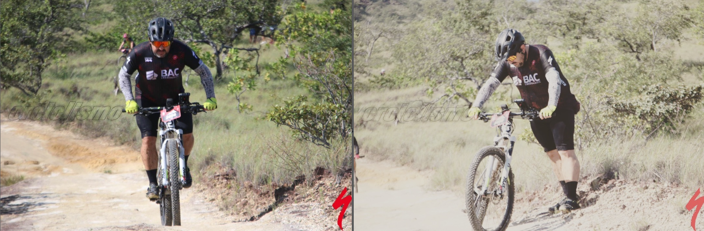

But that is a story which I will cover some other day. If you want to learn more about my journey from obese to fit-ish in my middle age, I am writing a book where I tell you what I had to learn to go from 103 kgs to 68 kgs, and going from 6 km rides to comfortably riding 250 kms and more. Maybe what I learned can help you too.

Subscribe for updates here: [https://xaviermorera.com/fitfatfit/](https://xaviermorera.com/fitfatfit/)

Let's continue. End of shameless plug.

What I am trying to learn now is how much calories I need to consume during rides to avoid bonking. Of course I need to take into account carbs, sodium, and liquids. But for today, I'll focus on calories.

The amount of calories you burn during exercise depend on many factors, including your: 
- Size (or body weight)
- Fitness
- Efficiency
- Duration of the exercise

In this exercise I am going to estimate how many calories I burn per hour, using an example of a ride with where the terrain was pretty flat and it was a somewhat constant effort.

I am going to use several different methodologies as a comparison point and will finish with the one from *Feed Zone Portables*. Strava had my heart rate, the power meter, weight, and exact speed so I would like to think it is the most accurate. By using all the other formulas I will get a feel into how precise they are.

I asked ChatGPT and Copilot for information on which are the formulas that are commonly used to estimate calories burned. Here are the formulas ChatGPT suggested:

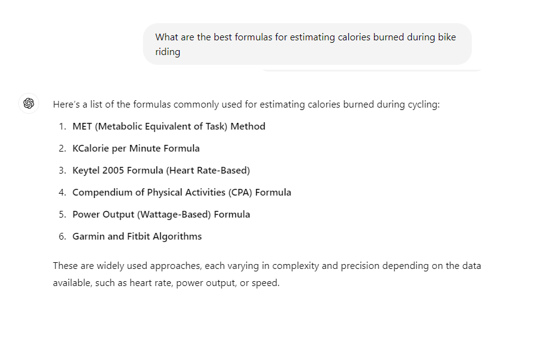

I'll just try a couple, compare with Strava and then use the one from the *Feed Zone Portables* book, which is what I want to focus on right now. Regarding the book, I am reading it to learn more about nutrition during rides and it has a formula that I want to test out.


BTW: Why am I learning to calculate calories?

First, because knowledge is power. If I can successfully understand what's my required consumption needs I can plan accordingly and get better at biking. That's one of my goals. 

I started to improve on my bike because I was the last person to always arrive. Always. So far behind that it was not even called "dropped". It was as if I was part of another group. Being really overweight and with terrible nutrition is not meant to be on a bike.

Now that I can do nice rides, I have many challenges in my future planned. For example, I am starting to prepare to go border to border in Costa Rica, so I need to calculate my fueling needs accurate-enough as it will be around 610 kms: [https://www.strava.com/routes/3253028325114536632](https://www.strava.com/routes/3253028325114536632)

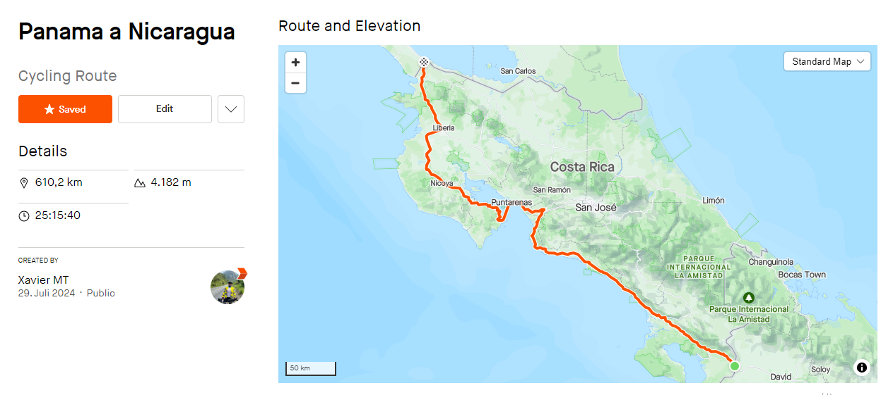

Now, let's get back to calculating and a bit of programming, for which I am going to use a particular ride to run create the functions, test the formulas and understand how it works.

## The Ride
Ticaban, which is a plain in the northern part of Costa Rica where we did 3 rounds with a motivated peloton, which meant the speed was pretty constant. 
https://www.strava.com/activities/11225188919.  

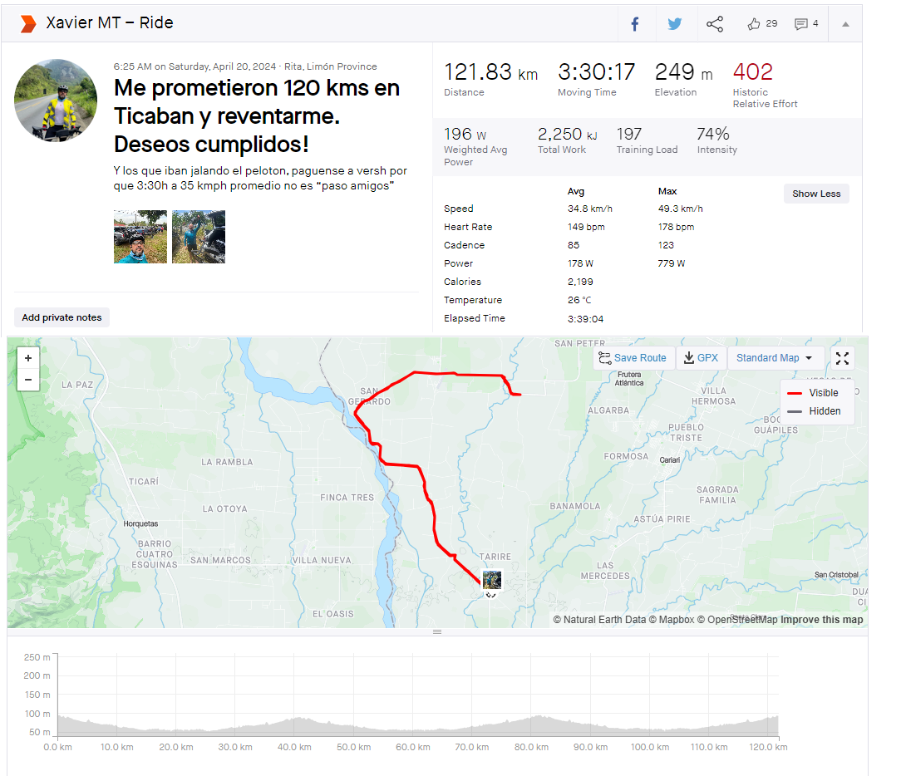

## The Stats
I have a powermeter and heart rate date, which means I have a decent amount of data to play with. Since it is pretty flat, it is a good point for calculations. How flat? An elevation gain of just 249 meters (817 feet) over 122 kms (76 miles).

According to Strava, I burned 2,199 calories and a total work of 2,250 kJ, with a weighted average power of 196 W and average power of 178 W.

Let's create the variables with the data:


```python
# The Data

# 121.83 kms (76 miles)
distance_meters = 121830
distance_kilometers = distance_meters / 1000

# 3 hours, 30 minutes, 17 seconds is equilavent to 12617 seconds
duration_moving_time_seconds = 12617
duration_moving_time_minutes = duration_moving_time_seconds / 60

# Elevation gain in meters
elevation_gain_m = 249

# Total work in kilojoules
work_kilojoules = 2250

# Calories burned according to Strava   
calories_strava = 2199 

# Average speed in km/h
average_speed_km_hour = 38.4

# Average power in watts
average_power_watts = 178

# Weighted average power in watts
average_power_watts_weighted = 196

# Average heart rate in beats per minute
average_heart_rate_bpm = 149

# Temperature in celsius
temperature_celsius = 26

# My age
age = 46

# My weight at Ticaban
weight_ticaban_kg = 77.5 

# My current weight
weight_kg = 69
```

## 1. Strava-like Formula Calculation on Flat Terrain: Ticaban
According to Strava, I burned 2199 calories. But what if I calculated it myself using the data from my rides as variables?

Let me start by creating a function that is (in theory) similar to the one that Strava uses. Let's see.

_Disclaimer: In theory, theory and practice are the same. But in practice, they are not!_


```python
def strava_calories_estimate(weight_kg, age, distance_km, moving_time_seconds, elevation_gain_m, avg_hr=None, avg_power=None, avg_speed_kmh=None):
    """
    Estimates calories burned using Strava's methodology.
    
    Parameters:
    - weight_kg: Body weight in kilograms
    - age: Age in years
    - distance_km: Distance covered in kilometers
    - moving_time_seconds: Moving time in seconds
    - elevation_gain_m: Elevation gain in meters
    - avg_hr: Average heart rate in beats per minute (optional)
    - avg_power: Weighted average power in watts (optional)
    - avg_speed_kmh: Average speed in kilometers per hour (optional)
    
    Returns:
    - Estimated calories burned
    """
    # Convert moving time to hours
    moving_time_hours = moving_time_seconds / 3600
    
    # Priority 1: Use power data if available
    if avg_power is not None:
        calories = avg_power * 3.6 * moving_time_hours
        return calories

    # Priority 2: Use heart rate data if available
    if avg_hr is not None:
        # Simple heart rate-based estimation
        # Using a basic formula: HRmax for males: 220 - age, use 70-85% effort for moderate cycling
        hr_max = 220 - age
        intensity_factor = (avg_hr / hr_max)  # Proportion of HRmax
        # Approximation: calories per minute based on intensity
        calories_per_minute = (8 + (intensity_factor * 10)) * weight_kg / 60
        calories = calories_per_minute * (moving_time_seconds / 60)
        return calories
    
    # Priority 3: Use MET values based on average speed if no heart rate or power
    if avg_speed_kmh is not None:
        if avg_speed_kmh < 10:
            met_value = 4.0  # light effort
        elif avg_speed_kmh < 13:
            met_value = 6.8  # moderate effort
        elif avg_speed_kmh < 16:
            met_value = 8.0  # vigorous effort
        else:
            met_value = 10.0  # very vigorous effort
        
        calories = met_value * weight_kg * moving_time_hours
        return calories
    
    # If no data available, return 0
    return 0
```

Using the function above, I made the two calculations and got the following results which are quite close to the *2199* calories that Strava calculated:
- I burned *2245.83* calories, if I used average power
- However, if I used *weighted* average power, the calculation was slightly higher and came out at *2472.93* calories

What is weighted average power?
Weighted average power (also known as Normalized Power) adjusts for intensity changes, giving more weight to harder efforts. It better reflects the physiological cost of the ride, especially during variable efforts like intervals or races. Thus, weighted average power is a more accurate measure of the ride's true intensity and stress on the body.

In this case I had opened my mouth and asked a couple of my friends (that are waaaay better than me) to just go ahead and kill me. They _almost_ succeeded! Given my personality, I did this on purpose to spark a flame and create a challenge with Eduardito. It made my day a lot more fun. Also, I got to ride in the peloton with the good guys like Will and Mario.

Needless to say, this ride is quite particular because of how flat the terrain is. Going uphill will burn more calories and will be harder to estimate, but for all intents and purposes what I want is to *learn how to calculate within reasonable limits how much calories I need to take on my longer rides*.


```python
# Example usage with the provided data using the formula I found on the internet for Strava
calories_strava_estimated_power = strava_calories_estimate(weight_ticaban_kg, age, distance_kilometers, duration_moving_time_seconds, elevation_gain_m, average_heart_rate_bpm, average_power_watts, average_speed_km_hour)
print(f"Calories burned using Strava calculation and average power: {calories_strava_estimated_power:.2f}")

calories_strava_estimated_power_weighted = strava_calories_estimate(weight_ticaban_kg, age, distance_kilometers, duration_moving_time_seconds, elevation_gain_m, average_heart_rate_bpm, average_power_watts_weighted, average_speed_km_hour)
print(f"Calories burned using Strava calculation and weighted average power: {calories_strava_estimated_power_weighted:.2f}")
```

    Calories burned using Strava calculation and average power: 2245.83
    Calories burned using Strava calculation and weighted average power: 2472.93
    

## 2. Strava-Like Formula Calculation on a High Climb

So this formula is pretty decent for this particular ride, but what if I test it on a ride with a notable elevation gain (4,577 meters / 15,017 feet), like for example the Alto de Letras? (Which is the world's biggest climb, according to GCN: https://www.youtube.com/watch?v=WIdpuVGO5zY)

Let's try it out.

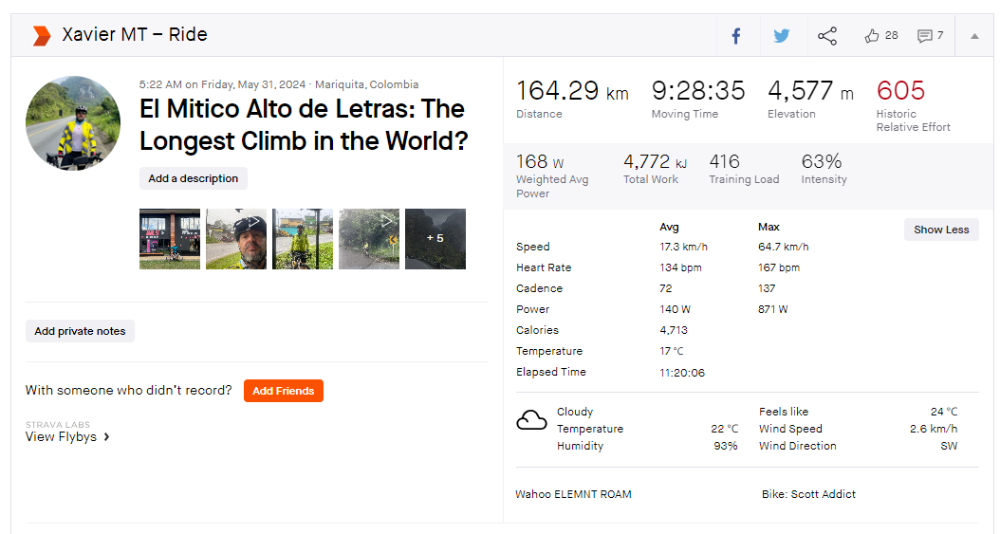

According to Strava I burned *4713* calories which is really close to the *4776* calories estimated using the formula above.

**Conclusion: Apparently, regarldess of whether it is a flat ride or the biggest climb in the world, the formula is decently accurate.**

_Disclaimer: I am not a sports coach, nutritionist or someone who specializes in these fields. I am a computer programmer, who was pretty obese + couldn't ride much and now I am very interested in learning about all this to become a better bike rider, be fit, and enjoy life._

Understanding the underlying science definitively gives me an edge so that I avoid the mistakes I used to make. For example, I used to stop at McDonalds to refuel. Yeah... don't judge me.


```python
calories_burned_alto_letras_calculated = strava_calories_estimate(73.5, 46, 164.29, 34115, 4577, 134, 140, 17.3)
print(f"Calories burned using Strava calculation and average power for Alto de Letras: {calories_burned_alto_letras_calculated:.2f}")
```

    Calories burned using Strava calculation and average power for Alto de Letras: 4776.10
    

How much is the difference? Let's see a percent difference, for which I will define a function and then calculate.


```python
def percent_difference(real_value, calculated_value):
    difference = abs(real_value - calculated_value) / ((real_value + calculated_value) / 2) * 100
    print(f"The percent difference between {real_value} and {calculated_value} is {difference:.2f}%")
    return difference
```


```python
calories_strava_alto_letras_real = 4713
percent_difference(calories_strava_alto_letras_real, calories_burned_alto_letras_calculated)
```

    The percent difference between 4713 and 4776.1 is 1.33%
    


    1.329946991811665


Let's try another one.

2. Keytel Formula
The Keytel 2005 formula is a method used to estimate the number of calories burned during physical activity, particularly in running or walking. It was developed by Keytel et al. in 2005 as a way to improve upon earlier models by taking into account more variables such as heart rate, age, weight, gender, and the type of activity being performed.

You can read more here: [https://pubmed.ncbi.nlm.nih.gov/15966347/](https://pubmed.ncbi.nlm.nih.gov/15966347/)

The formula is as follows:

For men: 

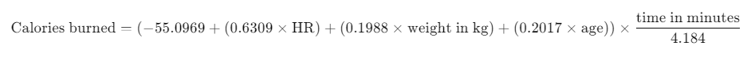
​

For women: 

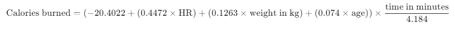
 

Where:

* HR is the heart rate in beats per minute
* Weight is the body weight in kilograms
* Age is the person's age in years
* T is the time of exercise in minutes
* 4.184 is the conversion factor to convert from kilocalories (kcal) to kilojoules (kJ)
* This formula is used in fitness trackers and other systems to provide more accurate calorie expenditure estimates during workouts.

Key Differences Between the Formulas:
* Heart Rate Coefficient: Men have a higher coefficient (0.6309) than women (0.4472), indicating that heart rate impacts calorie burn more for men.
* Weight Coefficient: Men also have a higher weight coefficient (0.1988) compared to women (0.1263).
* Age Coefficient: Age has a greater impact on men (0.2017) than on women (0.074).

These formulas adjust for individual factors like weight, heart rate, and age, making them more personalized for estimating calorie expenditure during physical activity.


```python
def keytel_2005_cycling(gender, heart_rate, weight_kg, age, time_minutes):
    """
    Calculate calories burned during cycling using the Keytel 2005 formula.

    Parameters:
    gender (str): 'male' or 'female'
    heart_rate (float): Heart rate in beats per minute (bpm)
    weight_kg (float): Weight of the individual in kilograms
    age (int): Age of the individual in years
    time_minutes (float): Duration of exercise in minutes

    Returns:
    float: Estimated calories burned
    """
    if gender.lower() == 'male':
        calories_burned = (-55.0969 + (0.6309 * heart_rate) + (0.1988 * weight_kg) + (0.2017 * age)) * (time_minutes / 4.184)
    elif gender.lower() == 'female':
        calories_burned = (-20.4022 + (0.4472 * heart_rate) + (0.1263 * weight_kg) + (0.074 * age)) * (time_minutes / 4.184)
    else:
        raise ValueError("Gender must be either 'male' or 'female'")
    
    # print(f"Calories burned: {calories_burned:.2f}")
    return calories_burned

```

Looking at the results from using the Keytel formula, it tells me I am burning quite a bit more calories than what Strava and my own Strava-like formula tell me, so I a not going use it for my future calculations.


```python
calculated_calories_keytel = keytel_2005_cycling('male', average_heart_rate_bpm, weight_ticaban_kg, age, duration_moving_time_minutes)
print("Keytel " + str(calculated_calories_keytel))
```

    Keytel 3196.0855274059913
    

How much does Keytel vary from the real data provided by Strava?


```python
percent_difference(calories_strava, calculated_calories_keytel)
```

    The percent difference between 2199 and 3196.0855274059913 is 36.96%
    


    36.962732929477745


What about quick calculations found on the internet? I

## 3. Calculator.net

I used this online calculator to determine a rough estimate. It receives very little data as input, so I am pretty skeptic about its results. 


And as expected, this calculation is pretty off. It is way way way too high. 72% difference is not usable. Oh well, I was just testing.

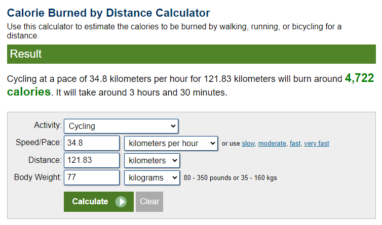

Use this URL to get the calculation: [https://www.calculator.net/calories-burned-calculator.html?c2activity=b&c2speed=34.8&c2speedunit=kph&c2distance=121.83&c2distanceunit=k&c2weight=77&c2weightunit=k&ctype=2&x=Calculate#bydistance](https://www.calculator.net/calories-burned-calculator.html?c2activity=b&c2speed=34.8&c2speedunit=kph&c2distance=121.83&c2distanceunit=k&c2weight=77&c2weightunit=k&ctype=2&x=Calculate#bydistance)


```python
calories_calculatordotnet = 4722
percent_difference(calories_strava, calories_calculatordotnet)
```

    The percent difference between 2199 and 4722 is 72.91%
    


    72.9085392284352


At this point I can keep testing the other methodologies, but since the Strava-like function is close enough, I'll move on into creating the function that uses the formula from Feed Zone Portables.

## 4. Feed Zone Portables
Feed zone portables is a book with a whole bunch of recipes for portable snacks that taste good. During my evolution as a (very amateur) cyclist, I started with Gu and McDonalds, then tried out a few different types of gels, and then trained for a while with Gu/Tailwind/Salt Sticks which worked decent enough for me. 

However, for very long rides my stomach was getting upset from time to time. 6+ hour rides on gels is not fun on your stomach (and backend) the day after.

I even decided I was going to fuel my rides only with peanut butter sandwiches and baked potatoes, until I made my calculations and discovered I needed a big backpack to carry like 14 sandwiches and several kilograms of salted baked potatoes.

My aim now is to learn how to cook, bake, saute or whatever is needed to create these tasty-looking treats. I am not a great cook, but I can figure it out (usually).

So, here I am figuring out right now _how much do I need to prepare for each ride_, which is the other part. More is not that much of an issue, the problem is "not enough" as I will bonk. 

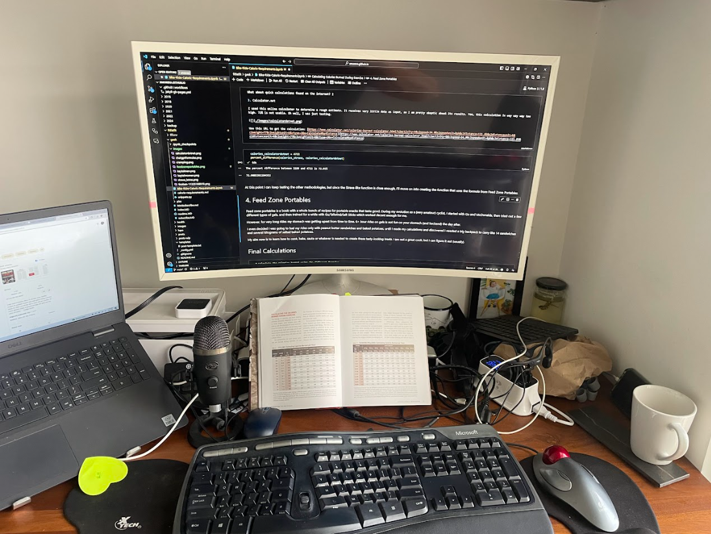


### The Feed Zone Portable Formula
The book has a table that tells me how many calories are burned per hour, give the power, speed and KJ. It uses certain correction factors.

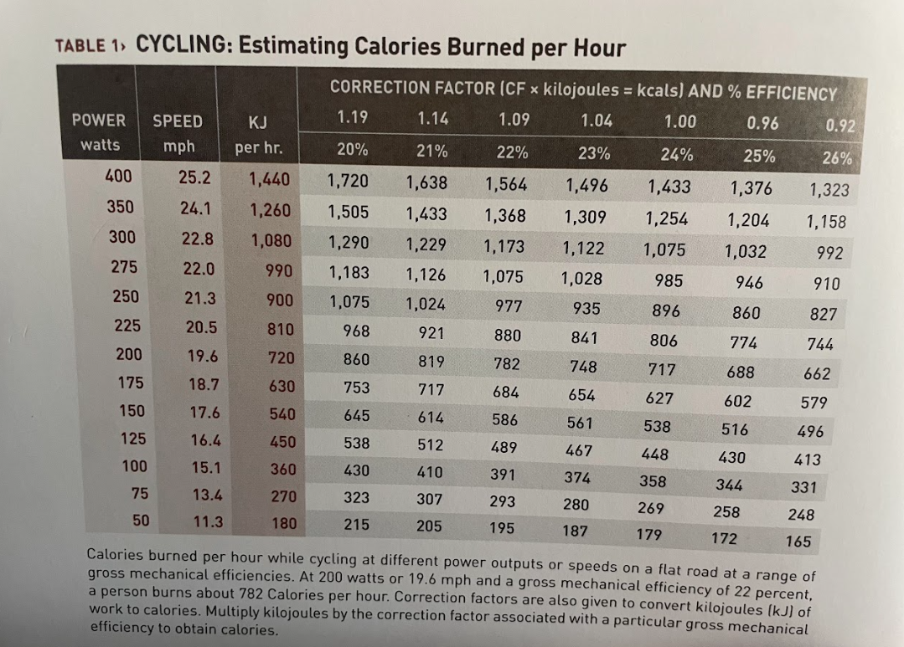

I uploaded the table to both ChatGPT and Gemini and asked it to create a formula to make the calculations. 

Let's test both results. These are the formulas it created:


```python
# ChatGPT
def calculate_calories_fzp_chatgpt(power_watts, efficiency_percent):
    # Lookup table for KJ per hour based on power (watts)
    kj_per_hour_table = {
        400: 1440,
        350: 1260,
        300: 1080,
        275: 990,
        250: 900,
        225: 810,
        200: 720,
        175: 630,
        150: 540,
        125: 450,
        100: 360,
        75: 270,
        50: 180
    }
    
    # Lookup for correction factors based on efficiency percentage
    correction_factors = {
        20: 1.19,
        21: 1.14,
        22: 1.09,
        23: 1.04,
        24: 1.00,
        25: 0.96,
        26: 0.92
    }
    
    # Get KJ per hour for the given power in watts
    kj_per_hour = kj_per_hour_table.get(power_watts, 0)
    
    # Get the correction factor based on the efficiency percentage
    correction_factor = correction_factors.get(efficiency_percent, 0)
    
    # Calculate calories burned
    calories_burned = kj_per_hour * correction_factor
    return calories_burned
```


```python
# Gemini
import pandas as pd

def calculate_calories_fzp_gemini(power_watts, speed_mph, kj_per_hour, correction_factor):
    """
    Calculates the estimated calories burned per hour during cycling.

    Args:
        power_watts: Power output in watts.
        speed_mph: Speed in miles per hour.
        kj_per_hour: Kilojoules per hour.
        correction_factor: Correction factor for converting kilojoules to kilocalories.

    Returns:
        The estimated calories burned per hour.
    """

    calories_burned = kj_per_hour * correction_factor
    return calories_burned
```

To test both, there are a few things that I need to convert as these functions calculate per hour and I want to calculate per the entire ride. 

But first I will confirm both yield the same results, given the same inputs.

I test and indeed they do. The difference is that ChatGPT simplified it by including the kj per hour table and correction factors inside the function while in Gemini I need to pass as parameter.

It is worth mentioning that one of the variables used in the calculation is efficiency which means how many of the calories that I take actually get to the pedals.

This is exactly the same as the efficiency in a gasoline vehicle, where it is said that only about 20% of the energy from gasoline is used by the wheels to propel the car forward. The rest of the energy is lost/wasted in friction, heat, or something else.

It is said that in an average cyclist, the efficiency is 22%. (suprisingly similar to gasoline!)


```python
# ChatGPT Sample Usage
power = 200  # Power in watts
efficiency = 20  # Efficiency percentage
calories_fzp_chatgpt = calculate_calories_fzp_chatgpt(power, efficiency)
print(f"Calories burned: {calories_fzp_chatgpt:.2f} Kcal (ChatGPT calculation)")

# Gemini Sample Usage
power_watts = 200
speed_mph = 20
kj_per_hour = 720
correction_factor = 1.19

calories_fzp_gemini = calculate_calories_fzp_gemini(power_watts, speed_mph, kj_per_hour, correction_factor)
print(f"Calories burned: {calories_fzp_gemini:.2f} Kcal (Gemini calculation)")
```

    Calories burned: 856.80 Kcal (ChatGPT calculation)
    Calories burned: 856.80 Kcal (Gemini calculation)
    

Now, I am going to calculate the amount of calories burned for Ticaban using this method. I will use the Gemini function as it receives more parameters.


```python
# Convert avreage speed from km/h to mph
average_miles_per_hour_ticaban = average_speed_km_hour / 1.60934

# Calculate the KJ per hour for the ride
def calculate_kj_per_hour(total_kj, hours, minutes, seconds):
    # Convert time to hours
    total_time_in_hours = hours + (minutes / 60) + (seconds / 3600)
    
    # Calculate kJ per hour
    kj_per_hour = total_kj / total_time_in_hours
    return kj_per_hour

# Calculate using Ticaban data
kj_per_hour_ticaban = calculate_kj_per_hour(work_kilojoules, 3, 30, 17)
# print(f"KJ per hour for the Ticaban ride: {kj_per_hour_ticaban:.2f}")

```

Now, I need to estimate how many calories are burned per hour and then convert to 3.5 hours.

The one variable that I do know  is efficiency, as mentioned above they vary from one person to another.

However, there is a formula to calculate it:

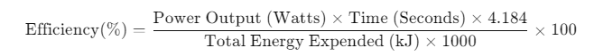

I tested with several correction factors and found out that using two decimals, I get close enough with 1.92% difference.


```python
# It is required to set the correction factor  
correction_factor = 0.96

# Calculate calories burned per hour using the Gemini formula
calories_burned_per_hour_ticaban = calculate_calories_fzp_gemini(average_power_watts, average_miles_per_hour_ticaban, kj_per_hour_ticaban, correction_factor)

print(f"Calories burned per hour for the Ticaban ride: {calories_burned_per_hour_ticaban:.2f} Kcal (Feed Zone Portables formula with Gemini function)")

# Using 3.5, which does not take into account the 17 seconds because meh...
total_calories_burned_ticaban_fzp = calories_burned_per_hour_ticaban * 3.5
print(f"Total amount of hours burned for the Ticaban ride: {total_calories_burned_ticaban_fzp:.2f} Kcal (Feed Zone Portables formula with Gemini function)")

# Difference in calculation
percent_difference(calories_strava, total_calories_burned_ticaban_fzp)
```

    Calories burned per hour for the Ticaban ride: 616.31 Kcal (Feed Zone Portables formula with Gemini function)
    Total amount of hours burned for the Ticaban ride: 2157.09 Kcal (Feed Zone Portables formula with Gemini function)
    The percent difference between 2199 and 2157.089640960609 is 1.92%
    


    1.924219311067666


## Final Conclusion
Calculating the calories required for a ride has a lot of variables, but by looking at a ride with very flat terrain and constant pace plus comparing with the total opposite, a very long ride with a huge climb and fast descents I could get to the conclusion that it is possible to calculate calorie consumption quite decently with the formula above or the Strava-like one.

The formula above worked quite decently for me with an efficiency of 25%, which I think is quite high and probably is not the reality (but dreaming is free).

Now I need to learn how to calculate carbs, sodium, and liquid which is another post.

Thank you and keep pedaling!


```python
# Calculate the calories burned using the different formulas


```


```python
print("Calories Burned Calcuation")
print(f"Strava: {calories_strava}")

calories_burned = strava_calories_estimate(weight_ticaban_kg, age, distance_kilometers, duration_moving_time_seconds, elevation_gain_m, average_heart_rate_bpm, average_power_watts, average_speed_km_hour)


print("Calculator.net " + str(calories_keytel_copilot))
 
```

    Calories Burned Calcuation
    Strava: 2199
    Calculator.net -810.2823961121734
    
