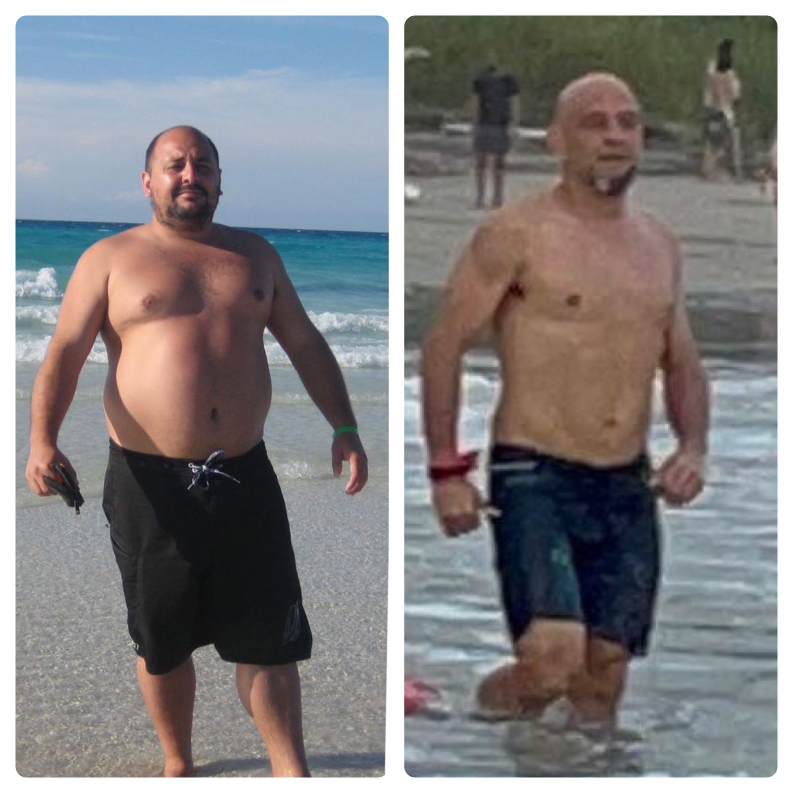
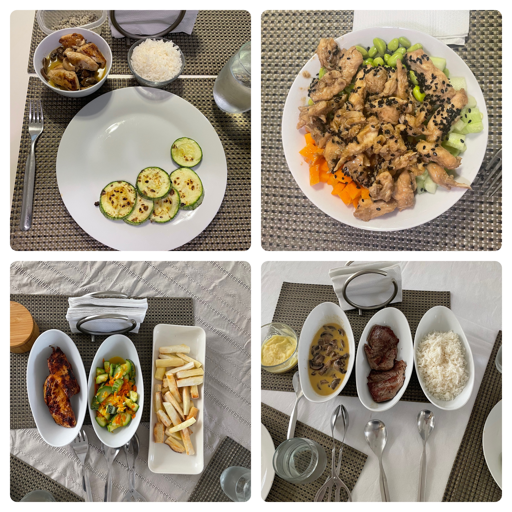

# Body Recomposition

Not very long ago, circa December 2022, I weighed 102.7 kgs, circa December 2022. 

Fast forward to October 2024 and I am 69.kgs. 

That's more than a bucket load of fat. In fact, there are small human beings (a.k.a. kids) that weigh the amount of fat that I lost. Also, I did not lose any muscle while doing all this, which is short of a miracle according to the gym trainer at the Indoor Club.

In fact, check out this before and after picture. The latter is how I looked like one week before having shoulder surgery.

I guess it is not that bad for a work in progress. But I had to stop going to the gym and since them I've lost a few kgs of hard muscle.

However, I am approaching the moment where I am going to be able to start hitting the gym again which means it is my time to start the next phase of my health seeking journey: **body recomposition**. 

_Side note: This is not an easy process. To achieve success, you need to have a very clear "why". I'll tel you about my why in another post._

**Body recomposition** is the process of simultaneously reducing body fat while increasing or maintaining muscle mass. Instead of focusing solely on losing weight or gaining weight, body recomposition aims to improve the ratio of muscle to fat, resulting in a leaner, stronger, and more defined physique.

**Where do I stand today?** 
Let's first set a baseline. These are my stats on Sept 2, 2024. Muscle mass is about 1.7kgs less than before surgery, but that's fine. 

Weight: 69.5 kg
Muscle mass: 32.3 kg (46.5%)
Body fat: 12.2 kg (17.6%)

Now, let's see what's involved.

### Key Elements of Body Recomposition:

1. **Fat Loss**: The goal is to reduce body fat percentage while keeping muscle mass intact. This is done through a combination of a slight calorie deficit and increased activity levels.
   
2. **Muscle Gain or Maintenance**: At the same time, I am going to aim to build or maintain muscle by following a structured strength training program and ensuring adequate protein intake.

### How Body Recomposition Works:
- **Calorie Control**: A slight calorie deficit (around 10-15% below maintenance) allows for fat loss, while not being so extreme that it prevents muscle gain or maintenance.

However, I am not going to be too strict on this process. I've decided to take it slow and make this a sustainable process, instead of a sacrifice. I want this to feel like my new normal, where I don't even notice that I am making any sacrifice.

If you take into account my BMR, which is around 1600, add up the TEF + NEAT and then subtract my daily activity, I estimate that I need to be in around 2500 calories per day, on those days that I train on my bike roller. That shouldn't be too hard, hopefully!
  
- **High Protein Diet**: Protein is crucial for muscle repair and growth. Aim for 1.6 to 2.2 grams of protein per kilogram of body weight to support muscle mass.

Not too difficult, given that in my house protein is something we eat plenty.

- **Strength Training**: Progressive overload (gradually increasing weights or reps) during strength training encourages muscle growth or maintenance.

Yeap, check. Kind of... until november as of today I am still out becuase of surgery.

- **Cardio**: Low to moderate intensity cardio can help burn additional calories and fat without risking muscle loss.

Check, bike roller and eventually swimming. 

All good until here. Now let's talk about the benefits. Although being kind of honest, my "why" right now is more of a "let's see where I can take this".  At one point in my life I was almost 50% body fat. My next step is 15% which is what my nutritionist told me to aim for.

However, being as stubborn as Shrek's Donkey, my goal is to be at least for a while at 12%.

Let's talk benefits.

### Benefits of Body Recomposition:
- **Improved Body Composition**: You may not see drastic changes on the scale, but your body will become leaner and more toned as muscle mass increases and fat decreases. Yeah, you'll look better. I'm not in it for the looks. I thought I was "just fine" at 100+ kgs and I am not looking for a girlfriend or anything of that sort. Love the wife and hope this post ages well.

I am looking for biking partners though. So, if you love hard rides and a little bit of healthy competition and adventure, [feel free to hit me up on Strava](https://www.strava.com/athletes/29440130). I'll follow you back.
  
- **Sustainable Results**: Body recomposition focuses on long-term, gradual improvements in muscle and fat balance, which can lead to lasting changes in your physique.

Yeah, you have to have patience. Took me about 20 years to be able to find a way to lose bucketloads of fat. Once I was able to sort-of-figure-out this thing, it took me 14 months to get to my quote-on-quote ideal weight. 

- **Increased Strength and Fitness**: Gaining muscle while losing fat typically leads to better overall performance and strength.

Being strong changes your life. Don't even ask me for the extra benefits. If you don't know them, get a nutritionist or go to the doctor.

### Who Is Body Recomposition Best For?
- **Beginners**: People new to strength training can often gain muscle and lose fat at the same time more easily.
  
- **People with Some Experience**: Even those with some training experience can achieve body recomposition with proper programming.

- **Those at Higher Body Fat Percentages**: If you’re starting with a higher body fat percentage, it’s easier to lose fat and build muscle at the same time.

### The Process
To achieve body recomposition—simultaneously building muscle and losing fat—you'll need to focus on a combination of nutrition, strength training, and recovery. Here’s a tailored plan based on your current stats:

1. Nutrition:
Nutrition is the key. Without it, none of it matters. My nutritionist is [Nutrifit](https://www.nutrifitcr.com/), in case you need some help. 

- Calories: Aim for a slight calorie deficit to lose fat, but not so aggressive that it hinders muscle growth. Start with a 10-15% deficit from your maintenance calories.

- Protein Intake: Prioritize protein intake to preserve muscle mass and aid recovery. A good target is 2.2–2.5 grams of protein per kilogram of body weight. For you, that’s about 153-175g of protein per day.
Carbs & Fats: Carbohydrates will fuel your workouts, so ensure you're eating enough complex carbs like oats, rice, and sweet potatoes. Healthy fats from sources like avocados, nuts, and olive oil are essential for hormone regulation and satiety. Balance these based on your preferences, but make sure to hit your calorie goals.

2. Strength Training:
There are two things to take into account.

- Compound Movements: Focus on big, compound lifts like squats, deadlifts, bench press, and rows. These exercises recruit multiple muscle groups, maximizing strength and muscle growth.

- Progressive Overload: Consistently increase the weight or reps over time to push your muscles to grow.
Frequency: Train 3-4 times a week, giving each muscle group at least 48 hours to recover. You can follow an upper/lower or push/pull/legs split.

3. Cardio:
Incorporate low-to-moderate intensity cardio like cycling to burn fat while preserving muscle. Aim for 2-3 sessions of 30-40 minutes per week.

4. Recovery:
Sleep: Aim for 7-9 hours of quality sleep each night. This is crucial for muscle recovery and fat loss.
Stress Management: High stress can increase cortisol levels, which can hinder fat loss and muscle growth. Consider mindfulness practices or yoga.

5. Tracking Progress:
Regularly check your body fat percentage and muscle mass, either through measurements or tools like a DEXA scan or bioelectrical impedance. In my case, my nutritionist's InBody is the guide.

Track your strength in key lifts to ensure you are progressively overloading. By balancing your nutrition and training while maintaining recovery, you'll be able to reduce body fat and build more muscle efficiently.

In summary, body recomposition is about shifting the balance between fat and muscle for a leaner, healthier body. It’s a gradual process, requiring the right balance of nutrition, training, and recovery to achieve the desired physique.

