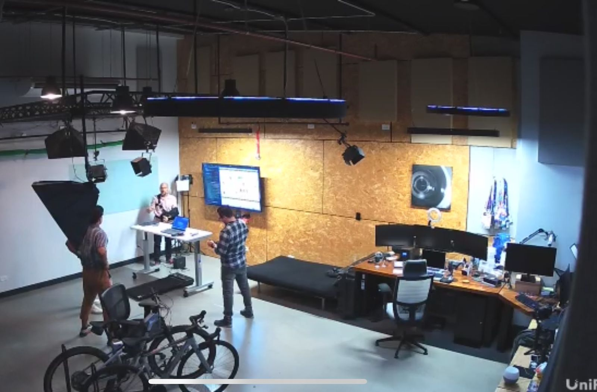

# “You are orders Of magnitude cheaper than Synthesia”  

Yeah, that’s what a potential customer told me yesterday. And we deliver at least the same or maybe even a lot more value.

Let me tell you the story of how I got here.

A few days ago I ran into a friend from old times. He asked me what I was working on and I told him about my [Pluralsight authoring](https://www.pluralsight.com/authors/xavier-morera) and my business, a company that specializes in training development, mainly in video. This company, [Lupo.ai](www.lupo.ai) basically automates the creation of videos, using a little bit of artificial intelligence and natural language processing.

Turns out that he works for a Seattle-based company with a few thousand  employees and he is in charge of the video production. He told me about their requirements and asked for more information.

Here are the things that they needed:
- The ability to quickly generate videos, minimizing the recording time and editing.
- Being able to localize in about seven different languages
- Provide a self service option to different departments across the company
- Allow non-technical people to generate videos quickly and in a cost-efficient manner
- Being able to enforce corporate branding.

In Costa Rica, we have a saying for this: “hunger just met wanting to eat”.

We have everything that they need and more. Coincidentally, his boss was going to be around the week after, so I invited them over to the office/recording studio.

They came and I really enjoyed this visit. They are wonderful people!I walked them through the story of how I ended up creating Lupo.AI from my over 20 years in the learning and development space, of which around 12 have been creating video content for Pluralsight, Cloudera, Microsoft, and other companies.

They were thrilled and happy, so at this point  we got to discussing the cost of our solution.

This is not a joke, but the boss literally said, “you are orders of magnitude cheaper than Synthesia” and yet we do the same thing.

Even further, given that we are a small company, we are willing to go the extra mile and develop our application further to suit their requirements. 

We are the underdog, which means we try harder!

Next step: We are going to start an initial project. And I am confident they are gonna like the results, just like the other companies that we have worked with, like Accenture and Vester Business.

If you are currently in need of creating videos for your customers, employees, vendors, for purposes, like training, customer, education, programs, on boarding, or similar, just go ahead and talk to me. 

You can find me here: https://calendly.com/lupoai/xavier

 Just let me know how you would like for us to help you.

